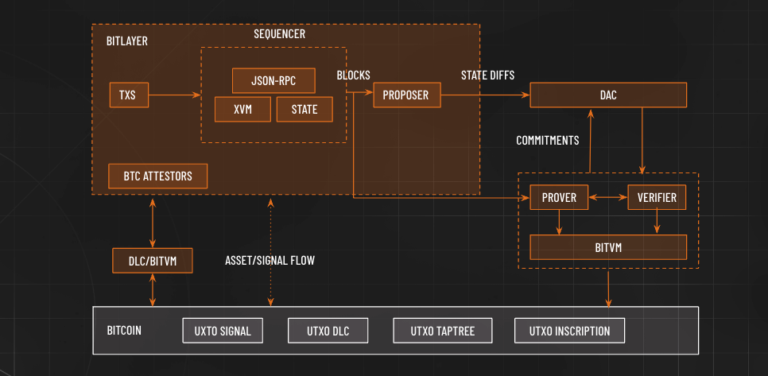

# Technical Architecture

Bitlayer's solution synthesizes the technical characteristics of BitVM, DLC|BitVM, and various XVMs (such as EVM, MoveVM), addressing three major challenges: Layer 1 verification, asset bridging, and enriching state transition expressions.

From an architectural standpoint, Bitlayer is a fairly typical example of a Rollup-equivalent model. To adapt to Bitcoin's unique programming model, BitVM has been introduced as a component for state challenges. Additionally, DLC|BitVM has been incorporated as a cross-chain component for messaging/assets, and the sequencer component's XVM, in theory, can support any Turing-complete programming language.

The security of bridge assets has always been a key for Layer 2 solutions, with the core issue being the method of asset control. The most common industry approach is for Layer 2 platform operators to set up multi-signature accounts based on MPC-TSS (Multi-Party Computation - Threshold Signature Scheme) or Schnorr technology, into which users transfer their assets. 

This traditional approach results in users completely losing control of their assets, while the platform's multi-signature management capabilities can impact the security of those assets. In the wake of certain extreme cases, users have become dissatisfied with these types of multi-signature solutions. Models like DLC|BitVM that encompass two-party game scenarios may be a better direction. Leveraging DLC|BitVM technology, users could retain partial control over their assets and potentially achieve a secure escape with their assets.

The verification of Layer 2 state transitions operates on a principle comparable to proving one's innocence—an inherently secure process. Theoretically, the choice of network used for state verification determines the security level of the Layer 2 network. As one of the most secure networks available, using Bitcoin's base layer for verification enables Bitlayer to inherit Bitcoin's robust security measures, achieving an equivalent level of security to Bitcoin itself. The introduction of the BitVM paradigm challenges the conventional view that complex computations cannot be performed on Bitcoin, offering a new pathway for executing Layer 2 state verifications on the Bitcoin network.

In terms of Layer 1 verification, autonomous asset escape, secure asset bridging, and EVM compatibility, Bitlayer exhibits superior performance compared to existing Bitcoin Layer 2 solutions such as Lightning Network and Stacks.
